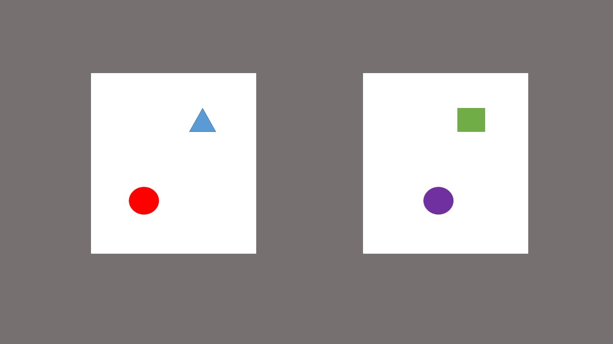

```{r setup, include=FALSE}
knitr::opts_chunk$set(echo = T, eval = T, warning = F, prompt = T, comment = '')
```

## From last week
* Last week we looked at the lm() function to run a linear regression
* This can fit a straight line to data
* This line is of the function $y = mx + c$
* *m* indicates the slope and *c* indicates the intercept

## From last week
* What about when that isn't appropriate?
* Let me show you an example

## ChickWeights
```{r}
setwd('~/R_Workshops')
ChickWeight <- ChickWeight
plot(weight~Time , data = ChickWeight)

```

## Linear Regression
```{r eval = F}
chickmod <- lm(weight ~ Time, data = ChickWeight)

ChickWeight$fit <- fitted(chickmod)

lines(ChickWeight$Time, ChickWeight$fit, col = 2)
```

## Linear Regression
```{r echo = F}
chickmod <- lm(weight ~ Time, data = ChickWeight)

ChickWeight$fit <- fitted(chickmod)
plot(weight~Time , data = ChickWeight)
lines(ChickWeight$Time, ChickWeight$fit, col = 2)
```

## Test the model
* We test linear regression with a Quantile-Quantile plot of the residuals
```{r}
qqnorm(resid(chickmod))
qqline(resid(chickmod), col = 2, lty = 2)
```

## Test the model
* A linear regression is inappropriate because it fails to capture the data
* An assumption is that the residuals will be normally distributed
* We can see from our data that this is inappropriate

## A better look at the data
```{r}
library(lattice)
xyplot(weight ~ Time | Chick, data = ChickWeight)
```

## A better look at the data
* We have forgotten two things:
    1. starting weight of each chick might vary (but not a lot in this case)
    2. growth rate of each chick varies dramatically
* We need to take this into account!

## Introducing lmer()
* lmer(), from lme4 allows fitting linear *mixed-effects* regression
* Using this we can take group or individual differences into account
* Remember $y = mx + c$?
* Both m and c come with a certain amount of error, which we account for this way

## Introducing lmer
* lm() only allowed us to fit the fixed effects of the model
* lmer() fits random and fixed effects
* Let's try it

## Adding a random intercept
* We do that with + (item|Object)
```{r}
library(lme4)
chickmod2 <- lmer(weight ~ Time + (1|Chick), data = ChickWeight)
```

## Adding a random slope
```{r}
chickmod3 <- lmer(weight ~ Time + (Time|Chick), data = ChickWeight)
qqnorm(resid(chickmod3))
qqline(resid(chickmod3), col = 2, lty = 2)
```

## Compare models
```{r}
anova(chickmod2, chickmod3)
```

## Assess model
```{r}
coef(summary(chickmod3))

ChickWeight$fit2 <- fitted(chickmod3)
```

## View model fit
```{r}
plot(weight~Time , data = ChickWeight)
lines(ChickWeight$Time, ChickWeight$fit2, col = 4)
```

## Eyetracking Analysis with eyetrackingR


## Eyetracking Analysis with eyetrackingR


## Eyetracking Analysis with eyetrackingR


## Eyetracking Analysis with eyetrackingR


## Load up your data and take a good look
```{r}
shape <- read.csv('ShapeBias2.csv')
```
* What are our column types?
* What do we need to change?

## Editing column types
* fix column types
```{r}
shape$TrialType <- as.character(shape$TrialType)
shape$Looking <- as.character(shape$Looking)
shape$Recording <- as.character(shape$Recording)
shape$Start_Time <- as.numeric(shape$Start_Time)
```

## Adding target columns
* We can use the *ifelse()* function instead of a for loop
* format is ifelse(condition, what to do if yes, what to do if no)
```{r}
shape$Target <- ifelse(shape$Looking == shape$TrialType, 1, 0)
shape$Other <- ifelse(shape$Looking == 'Out', 1, 0)
shape$Distractor <- ifelse(shape$Target == 0 & shape$Other == 0, 1, 0)
```

## EyetrackingR
```{r}
library(eyetrackingR)
```

## EyetrackingR
```{r}
data <- make_eyetrackingr_data(
          data = shape,
          time_column = 'Timestamp',
          participant_column = 'Recording',
          trial_column = 'Trials',
          aoi_columns = c('Target', 'Distractor'),
          trackloss_column = 'Other',
          treat_non_aoi_looks_as_missing = T)
```

## Make a meaningful time column
* EyetrackingR makes nice options for re-leveling the data we want
```{r}
response_window <- subset_by_window(data, 
                         window_start_time = 23000,
                         rezero = T, remove = F)
```

## Analysing trackloss
```{r}
#get trackloss data
trackloss <- trackloss_analysis(data = response_window)
#clean
response_window_clean <- clean_by_trackloss(
                data = response_window, 
                trial_prop_thresh = .3,
                participant_prop_thresh = .5)
```

## Analysing Trackloss
* What are we left with?
```{r}
trackloss_clean <- trackloss_analysis(data = response_window_clean)
```

## Basic window analysis
```{r}
library(ggplot2)
theme_set(theme_classic(base_size = 15))

response_window_agg_by_sub <- make_time_window_data(
  response_window_clean, 
        aois='Target',
      predictor_columns=c('TrialType'),
      summarize_by = "Recording")
```

## Basic window analysis
```{r}
plot(response_window_agg_by_sub, 
     predictor_columns = 'TrialType', dv = 'Prop')
```

## Basic window analysis
* How is Prop looking?
```{r}
hist(response_window_agg_by_sub$Prop)
```

## Basic window analysis
```{r}
t.test(Prop ~ TrialType, 
       data = response_window_agg_by_sub, paired = T)
```

## GCA
```{r}
response_time <- make_time_sequence_data(
  data = response_window_clean,
  time_bin_size = 100,
  aois = 'Target',
  predictor_columns = 'TrialType')
```

## GCA
* Take a look at the data
* ot1, ot2 etc refer to *Orthogonal Polynomials*
* Like with the window analysis, we have multiple DV options

## Let's peek
```{r}
plot(response_time, predictor_column = "TrialType") + 
  theme_classic() +
  coord_cartesian(ylim = c(0,1))
```

## So what is our DV?
* Something almost this extreme is not uncommon for babies
```{r}
hist(response_time$Prop)
```

## Fit a linear model (just linear time)
```{r}
l.m <- lmer(Elog ~ ot1 * TrialType +
              (1|Recording) + (1|Trials),
             REML = F, data = response_time)
```

## And check the fit
```{r}
plot(response_time, 
     predictor_column = "TrialType", 
     dv = 'Elog', model = l.m)
```

## Polynomials
* If the data is not linear, we may need extra terms
* We can use polynomials to better fit the data


## So you think you need a polynomial
```{r}
plot(response_time, predictor_column = "TrialType" ) + 
  stat_smooth() +
  theme_classic() +
  coord_cartesian(ylim = c(0,1))
```

## Cubic polynomial
```{r}
l2.m <- lmer(Elog ~ (ot1 + ot2 + ot3) * TrialType +
              (1|Recording) + (1|Trials),
            REML = F, data = response_time)
```

## Cubic model
* Check the output
```{r}
summary(l2.m)
```

## Check the fit
```{r}
plot(response_time, predictor_column = "TrialType", 
     dv = 'Elog', model = l2.m)
```

## Check the assumptions
```{r}
qqnorm(resid(l2.m))
qqline(resid(l2.m), col = 2, lty = 2)
```
* What does this tell us?

## Can we do better???
```{r}
full.m <- lmer(Elog ~ (ot1 + ot2 + ot3) * TrialType +
                 (ot1 |Recording) + 
                 (ot1 |Trials),
               REML = F, data = response_time)
```

## Check the difference
```{r}
anova(full.m, l2.m)
```

## A fully specified model
* All our time terms should be nested for this to make sense
* But there is considerable debate about this
* Because our data is transformed, the residuals make little sense
* I always advise caution here, because it's hard to check our working
* This is a fast way to approximate it though
